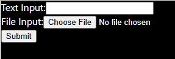
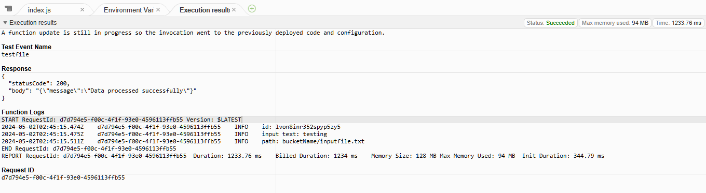

#  README
This readme will have instructions to set-up, and run the code. 

## Uploading inputfile to S3 Bucket.


Through the interactive GUI, a file named info.txt will be  downlaoded to the hosts download folder.

1. In the S3 AWS Console page, create a bucket, with the option to block all public access on.
2. Inside the bucket, upload the info.txt to the bucket. My info.txt was in the following format for testing purposes:
```
id: 12345
input_text:testing
input_file_path: bucketName/inputfile.txt
```
## Upload file to DynamoDB via API gateway and Lambda Function.

1. In order to save the file to DynamoDB, first create a table in the DynamoDB Console page in AWS, and call it FileTable.
2. In the API gateway page in AWS Console, go to Routes page accessed at the left side bar, and implement the following routes.
  - /items -> POST
  - /items/{id} -> GET, PUT, DELETE

In the AWS Lambda Console Page, create a new function, I have named it file-function.
By copying the index.js that I created in the Lambda console function in on the AWS, the file can succesfully be saved to DynamoDB FileTable
